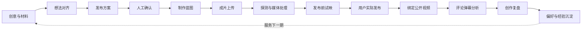
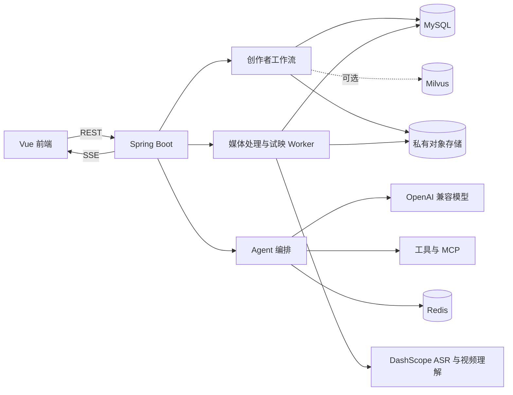

# LinkAgent

面向 B 站创作者的个人自托管 AI 工作台，按任务管理创作材料、想法对齐、发布方案、制作蓝图、
成片试映、观众反馈和复盘结果。

每个创作任务保存材料、AI 建议、决策依据、成片版本和发布后反馈。复盘结果可以在下一期发布前
继续使用。

[在线演示](http://linkagent.cloud) · [快速开始](#快速开始) · [核心能力](#核心能力) ·
[完整文档](docs/README.md) · [项目状态](#项目状态与边界)

> 演示站仅用于产品体验和联调，数据可能重置。项目默认面向一位创作者自托管使用，不是公开多用户 SaaS。

## 适用场景

LinkAgent 主要用于以下场景：

| 场景 | 对应功能 |
|---|---|
| 数据分散 | 用创作任务保存一期视频的材料和阶段结果 |
| 想法与方案容易偏离 | 先由双 Agent 对齐创作意图，再由创作者主动生成并确认发布方案 |
| 方案难以落到成片 | 将已确认方案转换为制作步骤、素材清单、工具建议和验收标准 |
| 发布前后数据断开 | 将评论弹幕分析、复盘结论和下一期行动写回任务 |
| 创作者偏好无法复用 | 保存偏好、采用记录和历史复盘 |
| 成片需要私有检查 | 通过私有对象存储、FFmpeg、ASR 和视频理解完成发布前试映 |

## 工作流



发布方案由创作者在想法对齐后主动生成并确认。确认后必须先完成制作蓝图、成片上传、媒体处理
和发布前试映；用户实际发布并绑定 BV 后，才能继续分析评论弹幕和生成复盘。

## 核心能力

### 创作与发布方案

- 保存选题、标题草稿、简介、字幕、文稿和补充材料。
- 通过主 Agent 与独立审查 Agent 对齐创作意图，AI 每轮只说明理解并提出关键问题。
- 发布方案由创作者主动触发生成；出现意图偏离时自动审查并最多重答一次。
- 综合材料、创作者偏好和案例证据，生成标题、简介、标签、分区和风险建议。
- 通过 SSE 展示 Agent 执行过程、审查结果和阶段进度。

### 制作蓝图与成片试映

- 将已确认的发布方案转换为制作步骤、素材清单、工具建议、预期产物和验收标准。
- MP4 分片直传私有 S3 兼容对象存储。
- 支持断点恢复、版本记录、短签读取、FFprobe 探测和 FFmpeg 预览、音轨、关键画面处理。
- 使用 DashScope ASR 建立字幕与毫秒级时间轴，通过 Qwen3-VL 完成全片粗审和最多 5 个重点片段复核。
- 基于同一证据包生成路人、目标观众和核心粉丝三类试映反馈，并整理可追踪的修改清单。
- 媒体处理和试映任务由数据库 Worker 推进，关闭页面后仍可继续并支持失败恢复。
- 通过工作流门禁避免跳过制作蓝图、媒体处理或成片试映直接进入发布后分析。

该能力默认关闭；关闭时可以体验材料录入、想法对齐和发布方案生成，但不能确认方案或进入后续
创作闭环。完整启用需要自行准备私有 Bucket、CORS、访问密钥、FFmpeg/FFprobe 和 DashScope Key。详见
[私有媒体配置](#私有媒体配置)。

### 公开视频与观众反馈

- 绑定 B 站 UID，同步公开投稿并校验任务与 BV 的归属关系。
- 支持手动粘贴、文件导入和单 BV 限量采集评论弹幕。
- 从真实样本中提炼高频观点、情绪、争议、误解和下一期内容机会。
- 基于报告与证据明细继续追问，向量检索链路可选开启。

### 复盘与长期记忆

- 汇总发布后视频指标、观众反馈和竞品分析，生成完整创作复盘。
- 将结构化报告导出为 Markdown，方便归档和分享。
- 保存创作者偏好以及建议的采用、修改和拒绝记录。
- 在后续创作中复用近期偏好和历史经验，减少重复输入。

### Agent 与知识库

- 基于 Spring AI 的 ReAct、规划与 Multi-Agent 编排。
- 支持工具调用、MCP、会话记忆、失败重试和用量追踪。
- 建立 B 站参考案例库，支持主题检索、向量检索和可选重排序。
- 记录模型、token、耗时和关联业务步骤，便于排查成本与质量问题。

## 快速开始

### 环境要求

- Docker
- Docker Compose
- 一个可用的 OpenAI 兼容模型 API Key

本地开发还需要 JDK 21、Maven，以及 Node.js `^20.19.0 || >=22.12.0`。

### 1. 获取项目

```bash
git clone https://github.com/lin-0407/linkAgent.git
cd linkAgent
```

### 2. 创建配置

```bash
cp .env.example .env
```

至少填写模型密钥。项目默认使用 DeepSeek 兼容地址和 `deepseek-chat`：

```dotenv
LLM_API_KEY=your-api-key
LLM_BASE_URL=https://api.deepseek.com
LLM_MODEL=deepseek-chat
```

如果需要在设置页保存模型密钥，还应生成并配置 `LINKAGENT_AES_KEY`。对外部署前请同时修改
示例中的 MySQL 密码。

### 3. 启动

```bash
docker compose up -d --build
```

首次启动会创建 MySQL、Redis、Milvus、etcd、后端和前端容器，并执行
`backend/src/main/resources/sql/init.sql`。

打开 <http://localhost:8088>。查看运行状态：

```bash
docker compose ps
docker compose logs -f backend
```

媒体能力默认关闭。此时可以体验创作材料、想法对齐和发布方案生成；若要确认发布方案并继续制作
蓝图、成片试映和发布后流程，请继续完成[私有媒体配置](#私有媒体配置)。

## 关键配置

### 模型与成本保护

| 变量 | 默认值 | 说明 |
|---|---:|---|
| `LLM_API_KEY` | 空 | 模型服务密钥，使用 AI 功能时必填 |
| `LLM_BASE_URL` | `https://api.deepseek.com` | OpenAI 兼容接口地址 |
| `LLM_MODEL` | `deepseek-chat` | 默认对话模型 |
| `DEEPSEEK_THINKING_ENABLED` | `true` | DeepSeek Flash 是否发送 `thinking.type=enabled` |
| `DEEPSEEK_REASONING_EFFORT` | `max` | DeepSeek Flash 思考强度，仅支持 `low`、`high`、`max` |
| `LINKAGENT_AES_KEY` | 空 | 加密设置页保存的模型密钥 |
| `LLM_GUARD_ENABLED` | `true` | 是否启用 Prompt 长度保护 |
| `LLM_GUARD_MAX_PROMPT_CHARS` | `30000` | 单次模型输入字符上限 |

### RAG 与向量检索

向量能力默认关闭，不影响基础创作流程：

```dotenv
VECTOR_STORE_TYPE=none
EMBEDDING_MODEL_TYPE=none
CREATOR_FEEDBACK_RAG_ENABLED=false
KNOWLEDGE_RAG_ENABLED=false
```

开启时需要配置 Embedding 服务、向量维度和 Milvus 集合。当前 Compose 使用
`milvusdb/milvus:v2.4.17`；原生 dense+BM25 hybrid 检索要求 Milvus `>= 2.5`，
因此升级服务端并重建集合前不要开启 `KNOWLEDGE_RAG_HYBRID_ENABLED`。

### 私有媒体配置

成片上传默认关闭：

```dotenv
CREATOR_MEDIA_ENABLED=false
```

开启前需要：

1. 创建私有 S3 兼容 Bucket。
2. 配置浏览器直传所需的 CORS：允许 `PUT`、`GET`、`HEAD`，并暴露 `ETag`。
3. 填写 `.env.example` 中的 `MEDIA_S3_*` 连接信息，并确保 Provider Endpoint 可被 DashScope 访问。
4. 确认后端运行环境可以执行 `ffmpeg` 和 `ffprobe`，且媒体工作目录可写。
5. 配置 `DASHSCOPE_API_KEY`，用于文件转写、全片视频理解和重点片段复核。
6. 将 `CREATOR_MEDIA_ENABLED` 改为 `true` 后重启后端。

对象存储始终保持私有。原片、代理视频和音轨只通过短时签名地址提供给浏览器或 DashScope；
数据库不保存访问密钥和短签 URL。完整配置与状态边界见
[项目文档索引](docs/README.md)中的阶段 7 媒体文档。

## 工程设计

### 报告结构化输出

反馈分析和最终复盘使用 Spring AI 的结构化调用。模型请求设置
`response_format=json_object`，`BeanOutputConverter` 根据 Java DTO 自动提供 JSON
schema；DTO 再检查必填文本、列表和嵌套属性。

JSON 语法合法但字段不完整时，模型最多重试三次。连续失败不会写入空报告，也不会把任务错误
推进为已分析。Markdown 只由后端根据已落库字段导出，不作为模型生成格式。

### 数据与隐私边界

- MySQL 保存任务、阶段结果、提示词和偏好。
- Redis 保存短期会话数据。
- Milvus 仅在启用向量能力时承载反馈证据和案例向量。
- 成片存入用户配置的私有对象存储，后端通过短签 URL 读取。
- 启用完整试映后，代理视频和音轨会通过短时 OSS 地址提交给 DashScope 进行 ASR 与视频理解。
- 项目不提供自动投稿，也不绕过平台限制获取数据。

### 技术栈

| 层 | 技术 |
|---|---|
| 前端 | Vue 3.5、TypeScript、Vite、Pinia、SSE |
| 后端 | Spring Boot 3.5.11、Spring AI 1.1.4、JDK 21 |
| 模型 | DeepSeek 或其他 OpenAI 兼容接口 |
| 数据 | MySQL 8.4、Redis 7.4、Milvus |
| Agent | ReAct、Planning、Multi-Agent、Tool Calling、MCP |
| 媒体 | S3 兼容对象存储、FFmpeg/FFprobe、DashScope ASR、Qwen3-VL |
| 部署 | Docker Compose、Nginx、S3 兼容对象存储 |

## 架构



主要目录：

```text
linkAgent/
├── backend/                 # Spring Boot 后端与数据库脚本
├── frontend/                # Vue 创作台、知识库和设置页面
├── scripts/                 # 本地受控采集脚本
├── docker-compose.yml       # 本地容器编排
├── .env.example             # 配置示例
└── README.md
```

## 本地开发

后端：

```bash
cd backend
mvn test
mvn spring-boot:run
```

前端：

```bash
cd frontend
npm install
npm run dev
```

生产构建：

```bash
cd frontend
npm run build
```

## 常见问题

**页面无法访问**

先执行 `docker compose ps`，确认 `frontend` 和 `backend` 已启动，再查看对应容器日志。

**模型调用失败**

检查 `LLM_API_KEY`、`LLM_BASE_URL` 和 `LLM_MODEL`。如果使用代理网关，还要确认它兼容
OpenAI Chat Completions 和 JSON mode。

**无法确认发布方案或进入发布后流程**

确认 `CREATOR_MEDIA_ENABLED=true`，并依次完成制作蓝图、成片上传与探测、媒体预处理和发布前试映。
发布后入口还要求当前试映对应最新的媒体处理结果。

**已拉取评论弹幕，但报告为空**

确认数据库中的 `feedback_analyze.system` 和 `report.system` 没有要求模型输出
Markdown。历史 `parse_status=RAW_ONLY` 报告不会自动转换，需要重新执行反馈分析或复盘。

**初始化表或提示词缺失**

查看 `db-init` 日志：

```bash
docker compose logs db-init
```

**完全重置本地数据**

以下命令会删除 MySQL、Redis 和 Milvus 的本地数据卷，只应在确认不需要现有数据时执行：

```bash
docker compose down -v
docker compose up -d --build
```
