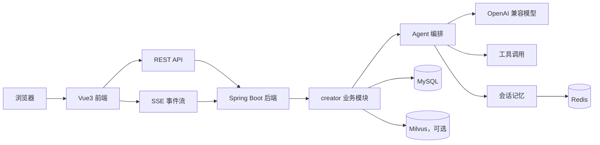
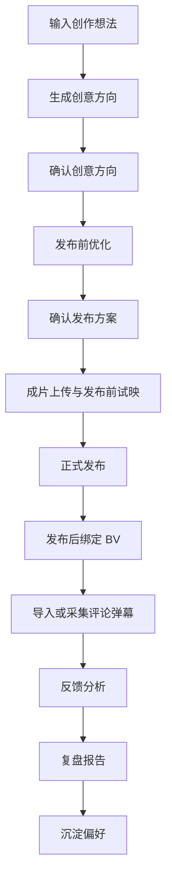

# LinkAgent

面向 B 站创作者的创作辅助工作台。当前主要覆盖创作任务管理、发布前标题/简介/标签优化、评论弹幕复盘、视频案例知识库、创作者偏好记忆和模型调用追踪。

演示入口：<http://linkagent.cloud>（仅演示用途，地址和可用性可能调整）

## 快速启动

以下命令由项目作者在本机执行。协作开发时，AI 助手不执行编译、测试、构建、运行或启动命令。

### 1. 准备环境

容器启动需要：

- Docker
- Docker Compose

本地开发还需要：

- JDK 21
- Maven
- Node.js `^20.19.0 || >=22.12.0`

### 2. 配置环境变量

复制示例配置：

```bash
cp .env.example .env
```

只启动页面和基础服务时，可以先不填 `LLM_API_KEY`。涉及模型调用的功能需要配置可用的 OpenAI 兼容网关。

```text
LLM_API_KEY=模型服务密钥
LLM_BASE_URL=OpenAI兼容接口地址
LLM_MODEL=模型名称
```

Docker Compose 会读取以下数据库和端口变量：

```text
MYSQL_ROOT_PASSWORD=link_agent_root_password
MYSQL_USER=link_agent
MYSQL_PASSWORD=link_agent_password
FRONTEND_PORT=8088
```

### 3. 启动

在项目根目录执行：

```bash
docker compose up -d --build
```

默认访问地址：

```text
http://localhost:8088
```

### 4. 排查

查看容器状态：

```bash
docker compose ps
```

查看后端日志：

```bash
docker compose logs -f backend
```

查看前端日志：

```bash
docker compose logs -f frontend
```

常见问题：

- 页面打不开：先看 `frontend` 容器是否启动成功。
- 后端启动失败：检查 MySQL、Redis、环境变量和 `init.sql` 初始化情况。
- 模型调用失败：检查 `LLM_API_KEY`、`LLM_BASE_URL`、`LLM_MODEL`。
- 初始化数据缺失：确认 MySQL 初始化脚本已执行。

需要重置本地数据时执行：

```bash
docker compose down -v
docker compose up -d --build
```

## 功能范围

当前已经落到代码里的主要能力：

- 创作任务：创建、编辑、删除任务，保存标题草稿、简介草稿、字幕、文稿和补充材料。
- AI 创意方案：根据用户输入生成多个创意方向，支持确认后进入发布前优化。
- 发布前优化：基于文稿、字幕、材料和偏好生成标题、简介、标签和修改建议。
- 工作流事件：通过 SSE 展示分析进度和 Agent 执行过程。
- 评论弹幕分析：支持手动录入、文件导入和单 BV 触发的样例采集。
- 复盘报告：汇总发布前建议和发布后反馈，支持 Markdown 导出。
- 创作者记忆：保存偏好、语气、视频类型语境，减少重复输入。
- 知识库检索：支持跨分区视频案例导入、主题检索、向量检索和可选重排序。
- 成本追踪：记录 LLM 调用模型、token、耗时、状态和关联业务步骤。

当前明确不做：

- 不做自动投稿。
- 不模拟 B 站推荐算法。
- 不绕过平台限制获取数据。
- 不内置无人确认的批量采集或定时采集任务。

允许的数据入口：

- 用户主动粘贴或上传的字幕、文稿、评论、弹幕样例。
- 用户输入单个 BV 后显式触发的限量样例采集。
- `scripts/` 下本地离线采集脚本产出的数据，再通过导入接口入库。

## 技术栈

| 层 | 选型 |
|---|---|
| 后端框架 | Spring Boot 3.5.11 |
| AI 框架 | Spring AI 1.1.4 |
| JDK | 21 |
| 模型接入 | OpenAI 兼容接口，具体网关和模型以运行配置为准 |
| 数据访问 | MyBatis 3.0.5 |
| 关系数据库 | MySQL 8.4 |
| 短期记忆 | Redis 7.4 |
| 向量库 | Milvus，可选开启 |
| 前端 | Vue 3.5、TypeScript 6、Vite 8 |
| 流式交互 | SSE |
| 部署 | Docker Compose、Nginx |

## 配置说明

### 模型配置

后端通过 Spring AI 的 OpenAI 兼容接口接入模型：

```text
LLM_API_KEY=
LLM_BASE_URL=
LLM_MODEL=
```

发布前优化、反馈分析、报告生成等功能需要模型配置。没有配置时，依赖 LLM 的接口会失败或只能走已有数据展示。

### RAG 与向量库

默认配置不启用向量链路：

```text
VECTOR_STORE_TYPE=none
EMBEDDING_MODEL_TYPE=none
CREATOR_FEEDBACK_RAG_ENABLED=false
KNOWLEDGE_RAG_ENABLED=false
```

开启反馈追问 RAG 或知识库 RAG 时，需要同时配置：

- Milvus 连接信息。
- Embedding 模型和维度。
- 对应业务开关。

注意：`docker-compose.yml` 当前使用 `milvusdb/milvus:v2.4.17`。配置里的原生 dense+BM25 hybrid 检索要求 Milvus 服务端 `>= 2.5`，因此当前 Compose 环境不要直接开启 `KNOWLEDGE_RAG_HYBRID_ENABLED=true`。如果要用 hybrid，需要先升级 Milvus 并重建对应集合。

### 数据库初始化

数据库 Schema 统一维护在：

```text
backend/src/main/resources/sql/init.sql
```

Docker Compose 首次创建 MySQL 数据卷时会自动执行该脚本。已有数据卷场景下，`db-init` 服务也会再次执行 `init.sql`，用于补齐新增表、字段和种子提示词。

## 目录结构

```text
linkAgent/
├── backend/                         # Spring Boot 后端
│   ├── src/main/java/com/link/linkagent
│   │   ├── creator/                 # 创作者业务：任务、建议、反馈、报告、B站绑定等
│   │   ├── knowledge/               # 视频案例知识库与 RAG
│   │   ├── core/                    # Agent 执行内核、PaE、Multi Agent
│   │   ├── tool/                    # 工具注册、执行、MCP 适配
│   │   ├── memory/                  # 短期记忆和长期记忆
│   │   ├── llm/                     # LLM 调用、回退链、用量统计
│   │   ├── prompt/                  # Prompt 模板与热更新
│   │   ├── settings/                # 运行期设置
│   │   └── common/                  # 通用异常、响应、文档解析
│   └── src/main/resources/sql/      # 数据库初始化脚本
├── frontend/                        # Vue3 前端
│   ├── src/api/                     # API 封装
│   ├── src/components/              # 页面组件和业务组件
│   ├── src/composables/             # SSE、工作流、任务状态逻辑
│   ├── src/stores/                  # Pinia 状态
│   └── deploy/nginx/                # 前端容器 Nginx 配置
├── docs/                            # 阶段文档、参考说明、问题记录
├── scripts/                         # 本地离线采集脚本
├── docker-compose.yml               # 本地容器编排
├── .env.example                     # 环境变量示例
└── README.md                        # 项目入口说明
```

## 主要链路





## 本地开发命令

以下命令用于作者本地执行。

后端常用命令：

```bash
cd backend
mvn test
mvn spring-boot:run
```

前端常用命令：

```bash
cd frontend
npm install
npm run dev
npm run build
npm run type-check
```

协作开发约束：AI 助手不得执行后端编译、测试、构建、运行或启动命令；前端命令可以用于检查和验证，启动前端服务后必须在验证结束时关闭相关进程。

## 文档入口

完整阶段文档、功能说明和问题记录见：

```text
docs/README.md
```

常用文档目录：

- `docs/develop/`：阶段方案和开发记录。
- `docs/reference/`：功能说明和接口说明。
- `docs/error/`：阶段性问题记录。
- `docs/Agent参考资料/`：Agent、工具调用、RAG、记忆、多 Agent 等参考资料。

## 协作约定

- 新功能开发优先参考 `docs/` 下的阶段文档。
- 数据库 Schema 统一维护在 `backend/src/main/resources/sql/`。
- 对外 API 入参校验使用 Jakarta Validation / Hibernate Validator。
- 项目注释使用中文，并说明为什么这样做。
- 前端相关变更不得修改 `package.json` 中的 Node.js 版本约束。
- 开发流程按 `skills/develop-process/SKILL.md` 执行。
