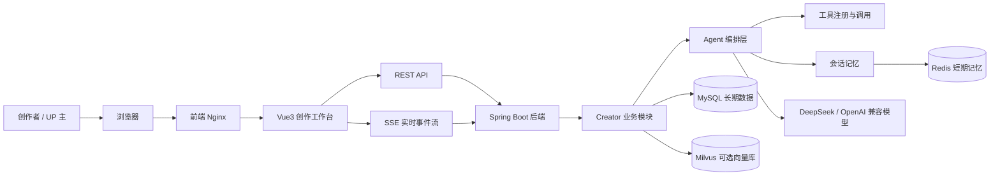
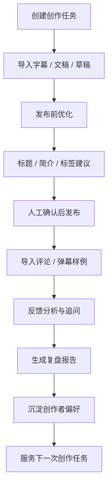
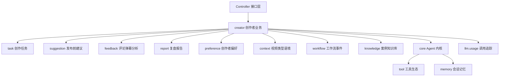

# LinkAgent Creator Copilot

LinkAgent Creator Copilot 是一个面向 B 站内容创作者的 AI 创作与复盘工作台。

它不是通用聊天机器人，而是围绕 UP 主的真实创作流程设计：从选题与稿件准备，到发布前标题、简介、标签优化，再到评论弹幕复盘、报告沉淀和创作者偏好记忆。

## 项目访问入口

| 类型 | 地址 |
|---|---|
| 项目域名 | <https://www.linkagent.cloud> |

## 项目定位

一句话说明：

```text
帮助 UP 主把一次视频创作任务中的材料、优化建议、观众反馈和复盘结论沉淀到同一个工作台。
```

项目重点解决三个问题：

| 问题 | LinkAgent 的处理方式 |
|---|---|
| 发布前不知道标题、简介、标签怎么改 | 基于字幕、文稿和创作材料生成结构化优化建议 |
| 发布后评论弹幕信息分散，难以复盘 | 把评论、弹幕和反馈样例汇总成观点、情绪、争议点和下一期建议 |
| 每次都要重复说明自己的账号风格 | 通过创作者偏好和语境库沉淀长期记忆，减少重复沟通 |

当前明确不做：

- 不做自动投稿。
- 不模拟 B 站推荐算法。
- 不绕过平台限制获取数据。
- 不内置无人确认的批量采集或定时采集任务。

允许的数据入口：

- 用户主动粘贴或上传的字幕、文稿、评论、弹幕样例。
- 用户输入单个 BV 后显式触发的限量样例采集。
- `scripts/` 下由作者本地离线运行的采集脚本，采集结果再通过导入接口合规入库。

## 整体链路图

下面这张图说明用户从浏览器访问到后端 Agent 工作流的主链路。



## 创作者业务链路

下面这张图说明一次创作任务从材料进入系统，到形成发布前优化和发布后复盘的过程。



## 核心能力

### 创作任务工作台

- 创建、编辑、删除创作任务。
- 保存标题草稿、简介草稿、字幕、文稿和其他创作材料。
- 支持材料文件导入，方便把分析入口集中到单个任务下。

### 发布前优化

- 分析字幕和文稿，提炼内容卖点。
- 生成标题、简介、标签建议。
- 给出建议理由、风险点和可执行修改方向。
- 通过 SSE 展示 Agent 工作流过程，让用户看到分析进度。

SSE 是服务器主动推送事件的机制，适合把模型分析过程一段段展示给前端。

### 评论弹幕分析

- 支持手动保存评论和弹幕样例。
- 支持文件导入评论和弹幕样例。
- 支持用户输入单个 BV 后显式触发样例采集。
- 输出高频观点、情绪倾向、争议点、误解点和下一期内容建议。
- 支持反馈追问，并可在开启 RAG 后结合证据回答。

RAG 是先检索相关材料，再让模型基于材料回答。它能减少模型脱离证据直接发挥的问题。

### 创作复盘报告

- 汇总发布前优化结果和发布后反馈分析。
- 生成结构化复盘报告。
- 支持 Markdown 导出，方便保存或二次整理。
- 报告和任务长期保存在 MySQL 中。

### 创作者偏好与语境记忆

- 记录创作者偏好，让后续建议更贴合历史风格。
- 维护创作者视频类型语境库，例如标题包装、表达禁忌、常见受众反馈。
- 区分短期任务上下文和长期创作者偏好，避免一次任务污染长期记忆。

### 知识库与高级检索

- 支持导入跨分区视频案例。
- 支持主题优先检索和分析上下文构建。
- 支持父级视频卡片、主题中块、评论弹幕子条目的多层索引。
- Milvus、Embedding、Hybrid 检索和 Rerank 都是默认关闭的可选能力，避免演示环境产生不必要成本。

### 可观测与评测

- 记录 LLM 调用模型、token、耗时和调用状态。
- 支持按任务查看 LLM API 开销。
- 支持 Prompt 版本评测、失败回放和分项评分。
- 保留 Agent 工作流步骤、原始输出和失败原因，方便复盘模型为什么输出不好。

## 技术栈

| 层 | 选型 |
|---|---|
| 后端框架 | Spring Boot 3.5.11 |
| AI 框架 | Spring AI 1.1.4 |
| JDK | 21 |
| 模型接入 | OpenAI 兼容接口，默认 DeepSeek 配置 |
| 数据访问 | MyBatis 3.0.5 |
| 关系数据库 | MySQL 8.4 |
| 短期记忆 | Redis 7.4 |
| 向量库 | Milvus，可选开启 |
| 前端 | Vue 3.5、TypeScript 6、Vite 8 |
| 流式交互 | SSE |
| 部署 | Docker Compose、Nginx |

## 后端模块关系



## 目录结构

```text
linkAgent/
├── backend/                         # Spring Boot 后端
│   ├── src/main/java/com/link/linkagent
│   │   ├── creator/                 # 创作者工作台业务模块
│   │   ├── knowledge/               # 视频案例知识库与 RAG
│   │   ├── core/                    # ReAct Agent 执行内核
│   │   ├── tool/                    # 工具注册、执行和 MCP 适配
│   │   ├── memory/                  # 短期记忆和长期记忆
│   │   ├── llm/                     # LLM 调用与用量统计
│   │   ├── prompt/                  # Prompt 版本与评测配置
│   │   ├── settings/                # 系统配置
│   │   └── common/                  # 通用异常与响应结构
│   └── src/main/resources/sql/      # 数据库初始化脚本
├── frontend/                        # Vue3 前端
│   ├── src/api/                     # 前端 API 封装
│   ├── src/components/              # 工作台组件
│   ├── src/composables/             # SSE 和 Agent 会话逻辑
│   └── deploy/nginx/                # 前端容器 Nginx 配置
├── docs/                            # 阶段文档、参考说明和踩坑记录
├── scripts/                         # 作者本地离线采集和导入辅助脚本
├── docker-compose.yml               # 本地演示编排
├── .env.example                     # 环境变量示例
└── README.md                        # 项目入口说明
```

## 快速体验

以下命令需要作者在本机执行。开发协作过程中，AI 助手不会执行编译、测试、构建、运行或启动命令。

### 1. 准备环境

需要提前安装：

- Docker
- Docker Compose

如果要在本地开发而不是只跑演示容器，还需要：

- JDK 21
- Maven
- Node.js `^20.19.0 || >=22.12.0`
- MySQL、Redis，可使用 Linux 虚拟机中的 Docker 容器提供

### 2. 配置环境变量

复制环境变量示例：

```bash
cp .env.example .env
```

最小演示可以先不填写 `LLM_API_KEY`，前端仍能查看初始化样例数据。

如果要调用真实模型分析，请至少配置：

```text
LLM_API_KEY=你的模型服务密钥
LLM_BASE_URL=https://api.deepseek.com
LLM_MODEL=deepseek-chat
```

默认演示数据库：

```text
MYSQL_ROOT_PASSWORD=link_agent_root_password
MYSQL_USER=link_agent
MYSQL_PASSWORD=link_agent_password
FRONTEND_PORT=8088
```

这些默认值只适合本地演示。部署到公网或服务器时必须改成自己的强密码。

### 3. 启动演示环境

在 `linkAgent/` 项目目录执行：

```bash
docker compose up -d --build
```

容器会启动：

- MySQL
- Redis
- Milvus 与 etcd
- Spring Boot 后端
- Vue 前端 + Nginx

访问地址：

```text
http://localhost:8088
```

线上域名：

```text
https://www.linkagent.cloud
```

### 4. 查看日志

如果页面打不开，优先查看容器状态和日志：

```bash
docker compose ps
docker compose logs -f backend
docker compose logs -f frontend
```

常见排查点：

- `frontend` 没起来：检查前端构建日志。
- `backend` 没起来：检查数据库连接、Redis 连接和环境变量。
- LLM 分析失败：检查 `LLM_API_KEY`、`LLM_BASE_URL`、`LLM_MODEL`。
- 样例数据没出现：确认 MySQL 初始化脚本是否已执行。

如果要重置演示数据，可以删除 Docker 数据卷后重新启动：

```bash
docker compose down -v
docker compose up -d --build
```

## 文档索引

完整阶段文档、功能说明和踩坑记录统一维护在 [`docs/README.md`](docs/README.md)。

## 协作约定

- 新功能开发优先参考 `docs/` 下的阶段文档。
- 数据库 Schema 统一维护在 `backend/src/main/resources/sql/`。
- 对外 API 入参校验使用 Spring Boot 自带的 Jakarta Validation / Hibernate Validator。
- 项目注释优先使用中文，并解释为什么这样做，而不是只描述做了什么。
- 前端相关变更不得随意修改 `package.json` 中的 Node.js 版本约束。
